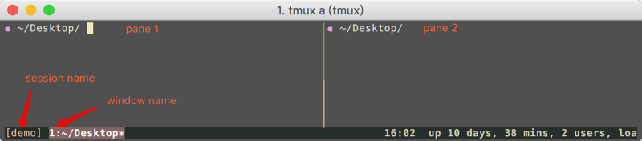

# 使用 tmux

Tmux 是一个终端复用器（terminal multiplexer），用于在一个终端窗口中运行多个终端会话，并保持这些终端会话。

## 会话与进程
命令行的典型使用方式是，打开一个终端窗口（terminal window，以下简称"窗口"），在里面输入命令。用户与计算机的这种临时的交互，称为一次"会话"（session）。会话的一个重要特点是，窗口与其中启动的进程是连在一起的。打开窗口，会话开始；关闭窗口，会话结束，会话内部的进程也会随之终止，不管有没有运行完。

一个典型的例子就是，SSH 登录远程计算机，打开一个远程窗口执行命令。这时，网络突然断线，再次登录的时候，是找不回上一次执行的命令的。因为上一次 SSH 会话已经终止了，里面的进程也随之消失了。

为了解决这个问题，会话与窗口可以"解绑"：窗口关闭时，会话并不终止，而是继续运行，等到以后需要的时候，再让会话"绑定"其他窗口。Tmux 就是会话与窗口的"解绑"工具，将它们彻底分离。

## 安装 tmux
默认 Amazon Linux 的 tmux 的版本非常低，我们需要手动安装 tmux。
1. 安装开发工具包
```bash
sudo yum groupinstall "Development Tools"
sudo yum install libevent-devel
sudo yum install ncurses-devel
```
2. 安装 tmux
```bash
wget https://github.com/tmux/tmux/releases/download/3.3/tmux-3.3.tar.gz
tar -zxf tmux-3.3.tar.gz
cd tmux-3.3
./configure
make && sudo make install  # install into /usr/local
tmux  # 运行 tmux
```

执行完以上步骤，我们就可以开始使用 tmux 了。

## tmux 的概念和使用
tmux 中有几个重要概念：
- 会话(session): 建立一个 tmux 工作区会话，会话可以长期驻留，重新连接服务器不会丢失，我们只需重新 tmux attach 
到之前的工作区就可以恢复会话，这样你的工作区就可以常驻服务器了，非常方便 
- 窗口(window): 容纳多个窗格 
- 窗格(pane): 可以在窗口中分成多个窗格，每个窗格都可以运行各种命令


一个tmux session（会话）可以包含多个window（窗口），窗口默认充满会话界面，因此这些不同的窗口中可以运行相关性不大的任务。

一个window又可以包含多个pane（面板），窗口下的面板，都处于同一界面下，这些面板适合运行相关性高的任务，以便同时观察到它们的运行情况。



## 使用 tmux
```bash
# 开启新session并命名
tmux new -s <session-name>

# 显示所有session
tmux ls

# 使用session编号接入
tmux attach -t 0
# 使用session名称接入
tmux attach -t <session-name>
tmux a -t <session-name>  # 简写

# 重命名会话
tmux rename-session -t <session-id/session-oldname> <new-name>

# 使用session编号切换
tmux switch -t <session-id>
# 使用session名称切换
tmux switch -t <session-name>

# 窗口常用快捷键
<prefix>, c  # 创建一个新窗口，状态栏会显示多个窗口的信息
<prefix>, <number>  # 切换到指定编号的窗口，其中的<number>是状态栏上的窗口编号
<prefix>, w  # 切换到指定编号的窗口，其中的<number>是状态栏上的窗口编号
<prefix>, ,  # 窗口重命名
<prefix>, !  # 关闭一个session中所有窗口

# 窗格常用快捷键
<prefix>, %  # 将当前窗口分成左右两个窗格
<prefix>, \"  # 将当前窗口分成上下两分，不要输入\
<prefix>, 方向键  # 让光标在不同的窗格中跳转 
<prefix>, C+方向键  # 可以调节光标所在窗口的大小 

# 在 pane 中翻屏
<prefix>, pgup/pgdn  # 退出翻屏的功能
q,  # 退出翻屏的功能
```
启用 tmux 之后，所有的 tmux 都需要首先使用 <prefix> 按键激活 tmux 的功能，默认的 tmux <prefix> 按键是 ctrl+b。

## 自动保存tmux会话
当一些特殊情况发生，机器需要重启，或者意外断电等导致关机，这个时候 tmux 的会话就全部丢失了。借助于
开源社区的解决方案，只需要简单地配置就可以实现 tmux 的会话的自动保存和加载。

整个解决方案由三个 tmux 插件组成。

- tpm：tmux plugin manager。这个是用来管理tmux插件的。有了它之后，就可以很轻松地安装和写在tmux插件；
- tmux-resurrect：这个是主角，提供了保存tmux会话到磁盘，以及从磁盘上加载保存的会话的功能。但是只能在需要的时候手动操作；
- tmux-continuum：提供了定时保存，自动加载，以及开机设置自动启动tmux的功能。需要tmux-resurrect来完成具体的工作；

```bash
git clone https://github.com/tmux-plugins/tpm.git ~/.tmux/plugins/tpm
```
然后，在~/.tmux.conf中配置：
```bash
set -g @plugin 'tmux-plugins/tpm'
set -g @plugin 'tmux-plugins/tmux-resurrect'
set -g @plugin 'tmux-plugins/tmux-continuum'

set -g @continuum-save-interval '60'
set -g @continuum-restore 'on'
set -g @resurrect-capture-pane-contents 'on'

# Other config ...

run -b '~/.tmux/plugins/tpm/tpm'
```

然后需要在 shell 中运行
```bash
tmux source ~/.tmux.conf
```
在 tmux 进程内，使用快捷键 <prefix>, I（注意要大写）, 来安装插件，安装完毕后就可以了。
```bash
<prefix> Ctrl+s    # 保存当前会话
<prefix> Ctrl+r    # 加载保存的会话
```